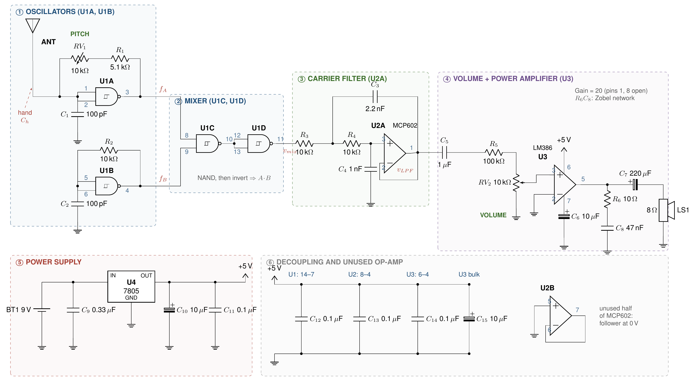

# Single-Package CMOS Heterodyne Theremin

A touchless musical instrument built from three ICs and no inductors. One **CD4093BE** quad Schmitt-trigger NAND chip handles every radio-frequency job: two ~692 kHz oscillators, a mixer and an inverter. An **MCP602** filters out the carrier, and an **LM386** drives an 8 Ω speaker. Everything runs from a single 9 V battery through a **7805** regulator.

This repo contains the IEEE-format paper, the schematic, the analysis scripts and the SPICE netlists used to verify every design value.

**Authors:** Chetansai Mihir P, Nainika Karthik, P Vigneshvaran, Rithikhaasree T
Dept. of Electrical and Electronics Engineering, VIT Vellore. Guide: Dr. Jitendra Goyal.

---

## Quick links

| What | File |
|---|---|
| Paper (PDF) | [`paper/theremin_paper.pdf`](paper/theremin_paper.pdf) |
| Schematic (PDF / 300 dpi PNG) | [`schematic/schematic.pdf`](schematic/schematic.pdf) · [`schematic/schematic.png`](schematic/schematic.png) |
| Design notes, corrections and to-do list | [`NOTES.md`](NOTES.md) |
| Original draft and slides (for reference) | [`docs/`](docs/) |



## How it works (30-second version)

```
ANT ─► U1A oscillator (f_A, shifts with hand) ─┐
                                               ├─► U1C NAND ─► U1D inverter ─► U2A low-pass ─► volume ─► LM386 ─► speaker
       U1B oscillator (f_B, fixed) ────────────┘
```

1. Your hand adds a fraction of a picofarad to U1A's timing capacitor, which pulls `f_A` down by about **3.9 kHz per pF**.
2. The NAND gate multiplies the two square waves. After averaging, its output is a **triangle wave at |f_A − f_B|**, which is the note you hear.
3. The Sallen–Key filter (f_c = 10.7 kHz) removes the ~692 kHz carrier, and the LM386 drives the speaker.
4. The **pitch pot** sets the base note and keeps the circuit on the side of zero beat where the pitch rises as your hand approaches.

## Key numbers

| Parameter | Value |
|---|---|
| Oscillator frequency | 692 kHz (SPICE: 692.2 kHz) |
| Antenna sensitivity | 3.9 kHz/pF |
| Zero-beat pot setting | RV1 ≈ 4.13 kΩ |
| Filter cutoff / Q | 10.7 kHz / 0.74 |
| Carrier rejection | ≈ 72 dB |
| Playing range | ~5–25 cm from antenna |
| Supply current | ~11 mA idle, ~50 mA playing |

## Repository layout

```
paper/        IEEE LaTeX source, class file, compiled PDF, figures
schematic/    CircuitikZ schematic source + rendered PDF/PNG
analysis/     model.py (oscillator model), make_figures.py (all plots)
spice/        ngspice netlists + behavioural models (models.inc)
docs/         original draft paper and presentation
NOTES.md      design notes, corrections, verification log, to-do
Makefile      rebuild everything
```

## Building

Requirements: TeX Live (with `circuitikz`, `tcolorbox`), Python 3 with `numpy`, `scipy` and `matplotlib`, `ngspice`, and `poppler-utils` (for `pdftoppm`).

```bash
make sim         # run SPICE simulations (~3 min)
make figures     # regenerate plots from model + SPICE output
make schematic   # rebuild schematic PDF/PNG
make paper       # compile paper/theremin_paper.pdf
make all         # all of the above
```

**Overleaf:** upload the `paper/` folder and compile `theremin_paper.tex` with pdfLaTeX.
